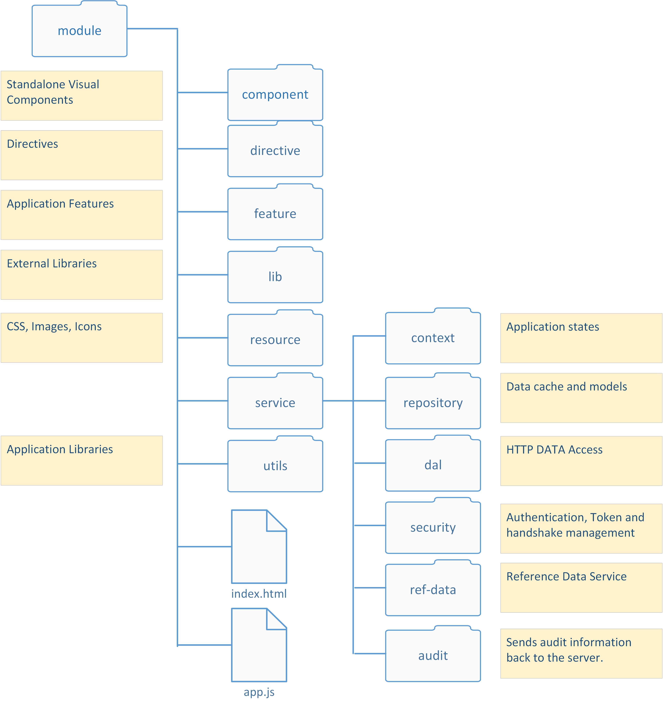

PAMM: Front-end Application Structure
=

###Packaging###
PAMM will utilise AngularJS native management for multiple modules.  Design and usage will be specified in future version of this document.

PAMM does however, provides a simple packaging mechanism that allows grouping.  TODO expand