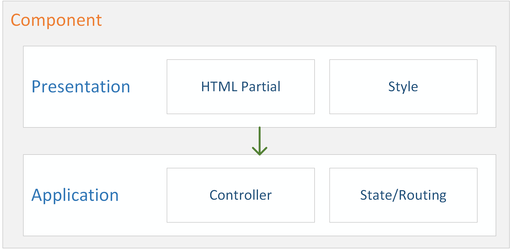
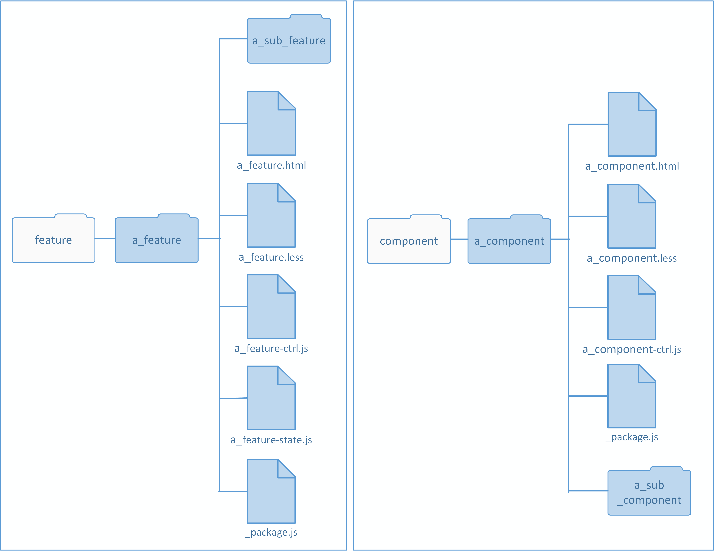
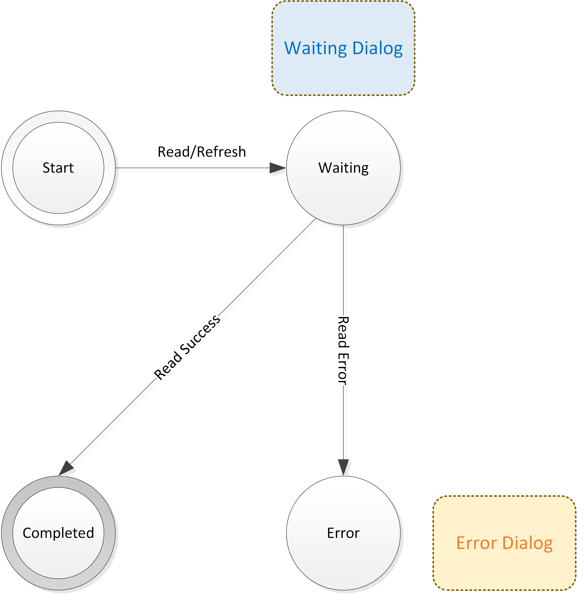
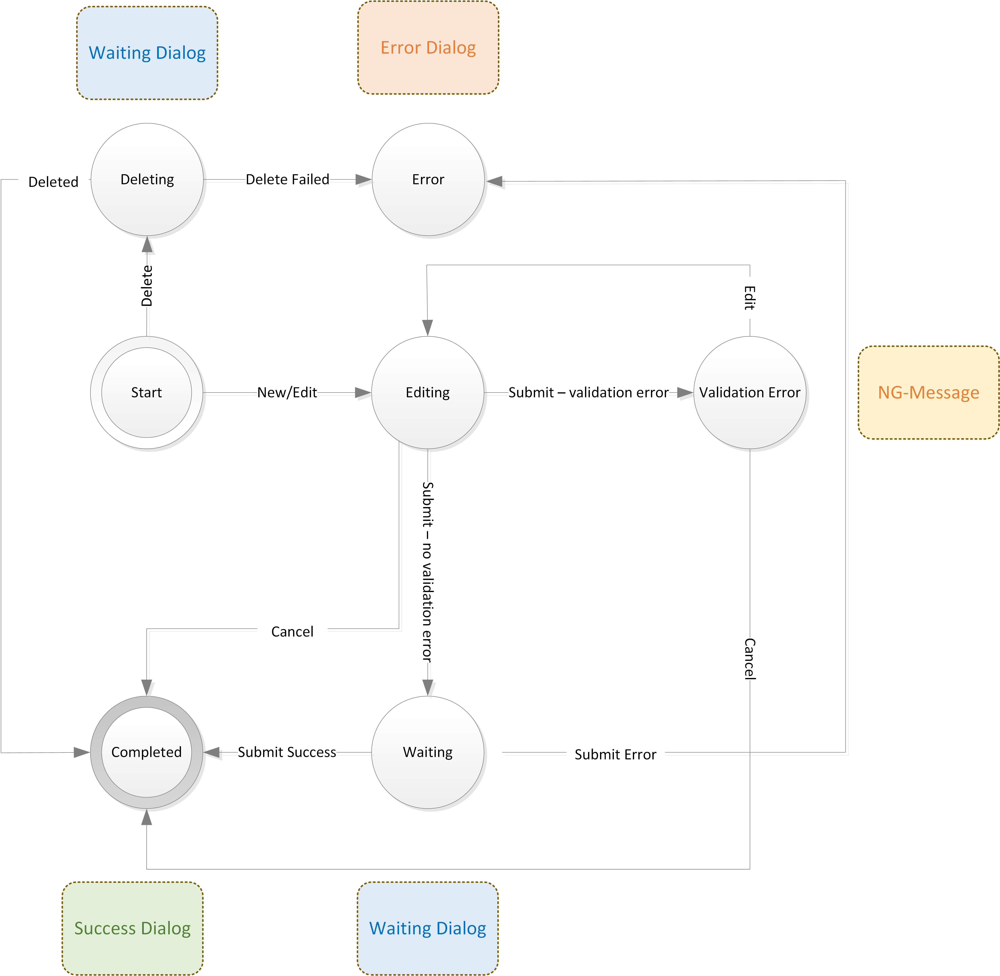

PAMM: Front-end - Feature, Business Process, Components
=

Component
-
A PAMM component is a section of independent functionality that is responsible for conveying and/or manipulating some information to user.  It comprises of one or more HTML partials in the presentation layer, and JavaScript modules in the application layer for the model and controller logic.  
 

 

*TODO expand*

PAMM is aimed at developing enterprise applications and hence it is heavily focused on implementing business processes.  A business process is a collection of human and/or automated tasks that together provide a particular service.  For example, consider the a common self-registration process:

1. User register account via self service portal
2. System verify that account is not already registered
3. System sends activation email

In the agile world this would equate to a story or feature.  In the context of PAMM,  a feature consists of a collection of human and automated tasks.  In other words, a work flow.  Although a business process may contains only automated tasks but as PAMM applications are WEB based, it will always consist of some form of human tasks.

 
###Feature and Comonent Directory structure###
 

 
###Read Component Life Cycle###
 

 
###Read/Write Component Life Cycle###
 

 
