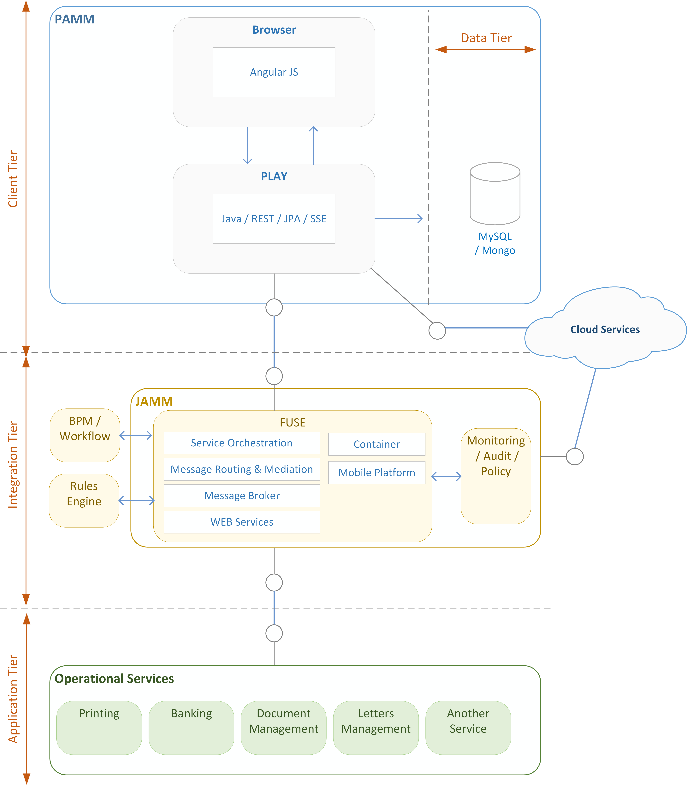

PAMM
=
- Getting Started
 - [Running The Application](/docs/getting-started.md)
- Architecture
 - [Architecture](/docs/architecture.md)
- Front-end: Concepts
 - [Application Structure](/docs/frontend/app-structure.md)
 - [Directives](/docs/frontend/directives.md)
 - [Feature, Business Process, Components](/docs/frontend/features-and-components.md)
 - [Repository](/docs/wip.md)
 - [DAL (HTTP Bridge)](/docs/wip.md)
 - [Context Management](/docs/frontend/context-management.md)
 - [Authentication](/docs/wip.md)
 - [Logging and Audit](/docs/wip.md)
 - [Coding Standard and Naming](/docs/wip.md)
- Backend: Concepts
 - [Application Structure](/docs/wip.md)
 - [Endpoint](/docs/wip.md)
 - [Domain Servces and Model](/docs/wip.md)
 - [DAL and Repository](/docs/wip.md)
 - [Security](/docs/wip.md)
 - [Audit and Monitoring](/docs/wip.md)
 - [Security](/docs/wip.md)
- Testing
 - [Approach](/docs/wip.md)
 - [Setup](/docs/wip.md)
 - [CucumberJS and Protractor](/docs/wip.md)
 - [Front Unit Test - Jasmine and Karma](/docs/wip.md)
 - [Backend Integration Tests via Play Mock Endpoints](/docs/wip.md)
 - [Backend Unit Tests](/docs/wip.md)

**Please note that although the code and design is stable, documentation is still work in progress.*

Overview
-
PAMM is an opinionated architecture optimized for data driven applications.  Together with its sister project, JAMM (integration TBA), offers a full enterprise stack.  It is important to understand that PAMM is not a framework and there is no API to force developers to code in a particular manner.  What PAMM offers is a ready made architecture that gives a head start for the development of typical digital/WEB applications.

The PAMM technology stack comprises of the following technologies:

- **Core:**
AngularJS,
Angular UI Router, 
PLAY2!, 
JAVA, 
JPA

- **Layout:**
LESS,
BootStrap 3,
BootStrap Dialog,
Font Awesome

- **Test Stack:**
Cucumber JS,
Protractor,
Jasmine,
Karam,
JUnit

 

 
 
### Client Tier ###
Within a multi-tier context, PAMM is the client tier that consists of an AngularJS application running within a browsers and the Play application server hosting it.  Angular applications are pure front-end solutions and no pages are generated on the server.  Therefore, the Play server is used only to provide application and routing logic exposed via REST.  The play server acts as pass through and no data or business logic is served from the Play server.  As such the Play server acts as a natural network break between the browser and back-end systems.  In security term, this would place PAMM in the internet access zone.

It is also possible to utilize PAMM for single tier applications.  In such cases the Play server would host business logic and access the database directly.  PAMM does not have an opinion where the database should sit but it is expected that it will reside within a separate tier for security reason.  In addition, it is also assumed that for normal deployments the Play Server will also sit behind firewalls. It is up to individual projects to fulfil any CLAS requirements in addition to normal penetration security. 

### Integration Tier  ###
The integration tier is responsible for connecting the client tier to the applications tier and is normally enable via an ESB that manages the standard routing and mediation between the endpoints.

### Application Tier  ###
The application tier consists of distinct business systems of the target environment, such as banking and document management.  These systems control and process business functions